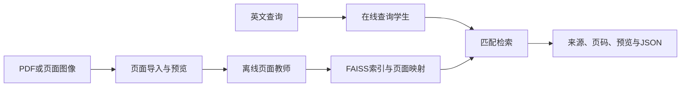

# FolioRecall（页寻）

Efficient Visual Document Retrieval

FolioRecall面向英文视觉文档检索。导入PDF或页面图像后，多模态教师离线编码页面；在线使用与教师对齐的轻量学生，返回文档来源、物理页码、分数和页面预览。支持LoRA检索训练、查询蒸馏、正式评测及本地常驻演示。

**源码及完整开发历史已公开，第四阶段本地核心验收完成。** 当前包版本为0.1.0rc2，版本标签和Release附件尚未发布。可以克隆源码安装；42页CPU示例包、LoRA750、第94步学生和实验附件仍待后续发布。本机候选保留在 `outputs/stage4/release-v0.1.0rc2-post-audit`，构建提交为25166ca，本轮不重打包。阶段状态以[开发计划第1节](doc/多模态文档检索项目开发计划.md#当前开发重点)为准。

## 实际使用


2026-09-14在移动后的42页示例、非Git CPU安装环境完成3条真实查询及Chrome页面验证。人口预测问题命中物理第10页Figure 3，页面预览和下载JSON与CLI一致。范围外问题仍可能返回无关页面，目前不提供无答案检测、答案生成或中文能力声明。



默认采用原始Qwen3-VL-Embedding-2B离线建库、公开NanoVDR ML学生GPU BF16查询；CPU FP32用于快速体验。未传 `--query-config` 的CLI保持教师查询行为。页面教师与索引身份校验先于模型加载，不能用维度相同代替空间兼容。

## 从 Git 安装源码

在Python 3.10、Ubuntu 22.04／WSL中执行。以下安装CPU依赖并检查命令入口；实际检索还需要匹配的页面索引。数据准备、BM25及GPU自有PDF流程见[使用说明](doc/首版使用与评测.md#外部获取与复现)。

```bash
git clone https://github.com/linlin-is-me/FolioRecall.git
cd FolioRecall
python3.10 -m venv .venv-cpu
source .venv-cpu/bin/activate
python -m pip install torch==2.8.0 --index-url https://download.pytorch.org/whl/cpu
python -m pip install '.[demo,eval]'
python -m pip check
CUDA_VISIBLE_DEVICES= python -m foliorecall --help
```

原始教师和公开EN／ML学生从固定上游revision获取。自有PDF需要GPU教师建库，随后同一原始教师索引可使用GPU或CPU学生查询；这些路径不依赖本项目待发布的模型附件。

## CPU快速开始

**42页示例体验待Release附件开放。** 以下下载命令当前不可用；已经取得本地候选的用户可复制同名文件后跳过下载。上面的Git源码安装无需这些附件。

已验证Python 3.10、Ubuntu 22.04／WSL。CPU体验不需要教师权重、CUDA、torchvision或训练组件。以下命令在同一个Bash终端执行；首次需要联网下载学生，之后可设置 `HF_HUB_OFFLINE=1`。

```bash
mkdir -p foliorecall-quickstart
cd foliorecall-quickstart
# 发布后从固定版本获取；发布前手动复制本地候选的这两个文件。
RELEASE_URL=https://github.com/linlin-is-me/FolioRecall/releases/download/v0.1.0rc2
curl -fL "$RELEASE_URL/foliorecall-0.1.0rc2-py3-none-any.whl" -o foliorecall-0.1.0rc2-py3-none-any.whl
curl -fL "$RELEASE_URL/demo-bundle.zip" -o demo-bundle.zip
python3.10 -m venv .venv
source .venv/bin/activate
export CUDA_VISIBLE_DEVICES=""
python -m pip install torch==2.8.0 --index-url https://download.pytorch.org/whl/cpu
python -m pip install './foliorecall-0.1.0rc2-py3-none-any.whl[demo]'
python -m pip check
python -c "from huggingface_hub import snapshot_download; snapshot_download('nanovdr/NanoVDR-Q-DistilBERT-Qwen3VL2B-2048-ML', revision='ab3f0fde9fcf407eaa756e1fc349ac09b7a716e7')"
python -m zipfile -e demo-bundle.zip .
cd demo-bundle
foliorecall query --index . --config configs/baseline.json --query-config configs/student-ml-cpu.json \
  'Which figure compares projections of the EU working-age population under baseline and no-migration scenarios?' --json
foliorecall serve --index . --config configs/baseline.json --query-config configs/student-ml-cpu.json
```

访问 `http://127.0.0.1:7860`。服务仅监听本机，持续加载一个学生和一个索引，切换配置后重启。单次CLI会重新加载模型。历史CPU实测首次加载约44秒，暖态页面显示准备P50/P95为272/285ms，Gradio客户端响应约1.038/1.069秒。客户端统计包含队列、序列化及响应元数据传输，排除预览下载与浏览器渲染；核心编码延迟不能替代界面耗时。

GPU自有PDF建库、源码安装、模型获取与五域复现见[首版使用与评测](doc/首版使用与评测.md#外部获取与复现)。GPU路径已在RTX 4060 Laptop 8GB验证；CPU查询支持不代表CPU教师建库已验收。

## 核心结果

| 查询候选 | 五领域宏平均 nDCG@10 | Recall@5 / @10 |
|---|---:|---:|
| 原始教师 GPU BF16 | 0.537845 | 0.479970 / 0.580596 |
| LoRA750 GPU BF16 | 0.573712 | 0.504133 / 0.612973 |
| 公开 EN GPU BF16 | 0.566762 | 0.497533 / 0.605997 |
| 公开 ML GPU BF16（默认） | 0.567706 | 0.502397 / 0.611766 |
| 蒸馏第94步 GPU BF16 | 0.437830 | 0.390437 / 0.484633 |
| 公开 EN CPU FP32 | 0.567026 | 0.497746 / 0.606333 |
| 公开 ML CPU FP32 | 0.567807 | 0.502201 / 0.611982 |
| 蒸馏第94步 CPU FP32 | 0.437294 | 0.389126 / 0.483769 |
| 页面 BM25 CPU | 0.516565 | 0.455363 / 0.553117 |

LoRA750相对原始教师的宏平均nDCG@10提高0.035867，五域中四域提高，Finance-EN下降0.021927；完整请求P50约44.72–45.07 ms，高于原始教师的30.66–32.37 ms。公开ML相对原始教师提高0.029861，同卡BF16编码P50快6.23–7.65倍，完整请求P50为4.51–6.61 ms。CPU ML是独立部署方案，不能把跨设备耗时比称为编码加速。第94步相对公开ML下降0.129877，保留为无收益对照，不更换默认模型，也不追加训练。

配对重采样使用(task, query_id)，固定seed42、10000次，任务内抽样后等权汇总。上述三组nDCG差值的95%区间分别为[0.024763, 0.046843]、[0.019750, 0.040209]、[-0.141093, -0.118967]。区间只描述这些固定任务的查询波动，不证明文档独立或上游未见过测试内容。公开学生的收益来自NanoVDR上游模型，本项目贡献是接入、匹配校验、继续蒸馏对照与完整评测。

正式评测使用原始相关性等级、完整候选库、batch1、线程4/1、5次预热和固定顺序3轮，各配置独立进程。完整请求从输入文本计时到Top-10 JSON就绪，加载及界面另计，不混合不同领域计算P95。逐领域质量、分项延迟、显存、RSS、建库成本、误例与局限见[首版使用与评测](doc/首版使用与评测.md#本轮实测结果)，机器记录为 `outputs/stage4/formal-complete`。

## 本项目的工作

- 接入Qwen3-VL与完整NanoVDR查询模型包，分离页面和查询入口，实现教师身份及索引兼容检查。
- 实现PDF导入、可恢复页面建库、CLI与常驻页面演示，完成非Git安装和可搬移示例验证。
- 完成LoRA训练、数据对照及3000查询继续蒸馏，验证梯度、保存重载和确定性恢复，保留无收益结果。
- 在五域完整任务上比较检索质量、在线成本、资源和建库成本，校正指标同分规则并复核错误案例。

公开学生的质量与速度收益来自NanoVDR上游模型；本项目没有提出新骨干，也没有将退化的继续蒸馏结果作为成功压缩成果。

## 模型与实验入口

| 资产 | 用途 |
|---|---|
| 原始Qwen教师、公开EN／ML学生 | 从配置中的固定Hugging Face revision获取，不随项目重复分发 |
| `lora750.zip` | LoRA适配器、tokenizer／processor和配置；用自身配置建立匹配页面库 |
| `distilled94.zip` | 完整蒸馏学生，仅作实验对照；查询匹配原始教师索引 |
| `experiment-evidence.zip` | 五域指标、排名、逐请求计时、教师记录及实际运行依据 |
| `release-manifest.json` | 发布资产、构建版本及验证状态 |

上述资产统一准备为[GitHub预发布](https://github.com/linlin-is-me/FolioRecall/releases/tag/v0.1.0rc2)附件，当前尚待发布。训练及蒸馏步骤见[使用说明](doc/首版使用与评测.md#训练与蒸馏复现)，历史选择过程见[查询学生与蒸馏](doc/查询学生与蒸馏.md)。

## 第二阶段接续

第二、三阶段已完成；历史环境、方法对照和接续记录保留在[使用说明的历史记录](doc/首版使用与评测.md#历史开发与本机环境记录)。这些路径与预算属于既有实验，新机器使用上面的公开入口。

## 局限与来源

结果来自单seed和固定英文任务；HR有20条查询曾用于流程检查，上游训练重叠与文档级隔离尚未核实。LoRA在Finance-EN退化，继续蒸馏第94步明显退化。原HR建库的部分资源字段缺失，仍保留缺失。中文、多seed、无答案识别、ONNX/int8和重排序属于后续候选，不是当前能力。

自有代码采用[Apache-2.0](LICENSE)。Qwen、NanoVDR、Sentence Transformers等来源见[NOTICE](NOTICE)。42页示例保留European Union来源和素材许可，剔除已知第三方图片，不附完整PDF；项目许可不覆盖上游文档。协作规则见[AGENTS.md](AGENTS.md)，阶段状态统一维护在[开发计划](doc/多模态文档检索项目开发计划.md)。
