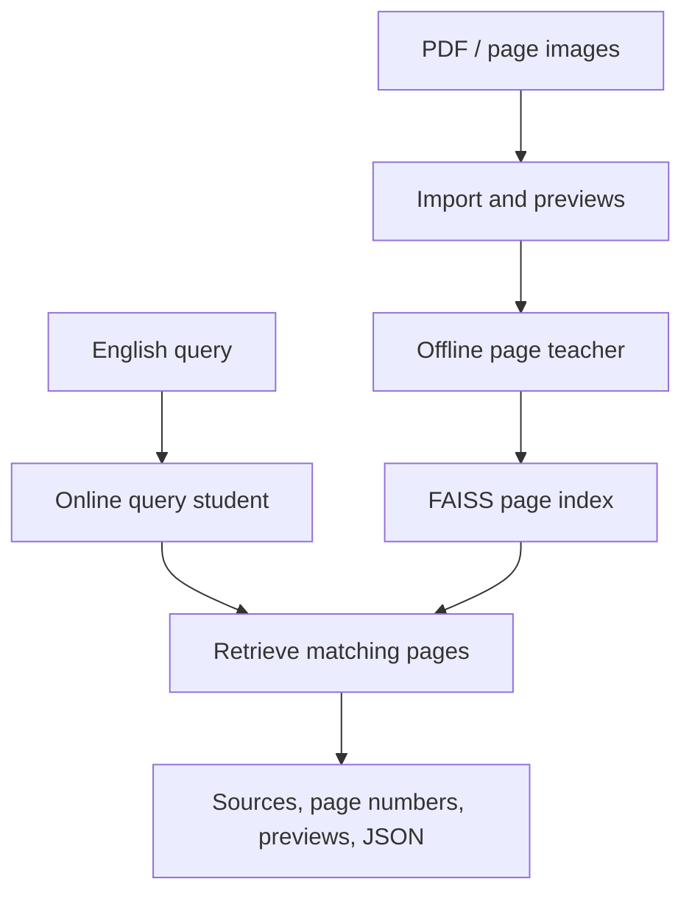

<h1 align="center">FolioRecall · 页寻</h1>
<p align="center"><strong>Page-level visual document retrieval with lightweight query encoders</strong></p>
<p align="center">Find relevant pages in English documents, with document sources, physical page numbers and previews.</p>

<p align="center">
  <a href="LICENSE"></a>
  <a href="#quick-start"></a>
  <a href="pyproject.toml"></a>
</p>
<p align="center"><strong>English</strong> · <a href="README.zh-CN.md">简体中文</a></p>
<p align="center"><a href="#demo">Demo</a> · <a href="#results">Results</a> · <a href="#quick-start">Quick Start</a> · <a href="#models--documentation">Documentation</a></p>

FolioRecall separates offline page encoding from online query encoding. A multimodal teacher builds the page index; an aligned lightweight student searches it. The project combines a usable retrieval application with LoRA training, query distillation and quality–cost evaluation.

> Source code is available. The example bundle and experiment assets are awaiting release.

## Features

- **Page retrieval:** import PDFs or page images and return ranked pages with sources, physical page numbers, previews and downloadable JSON.
- **Independent query encoders:** load complete Qwen3-VL or NanoVDR packages, with teacher–index compatibility checks before model loading.
- **Resumable indexing and local serving:** save page embeddings in chunks; share retrieval logic between the CLI and a persistent, single-model Gradio app.
- **Training and evaluation:** run LoRA adaptation, query-vector distillation, BM25 and neural retrieval comparisons, with measured latency and resource use.

## Demo

An English question about EU working-age population projections retrieves **physical page 10, Figure 3** from the report. This is a real CPU retrieval session on the 42-page example index; the current interface is in Chinese.

<p align="center">
  <a href="doc/assets/stage4-cpu-demo.png"></a>
</p>

The screenshot demonstrates an existing local example. Its downloadable bundle is pending release; you can already index your own PDF with the GPU workflow below.

## Architecture



The default combination is **original Qwen3-VL-Embedding-2B for indexing + public NanoVDR ML for GPU BF16 queries**. CPU FP32 queries can reuse the same original-teacher index. LoRA requires its own matching page index; equal embedding dimensions alone do not establish compatibility. Omitting `--query-config` in the CLI retains teacher-based queries.

The project's implementation work covers model integration, index compatibility, resumable data processing, CLI/app retrieval and controlled experiments. The backbone and public query students come from upstream projects.

## Results

Five fixed English tasks—HR, Computer Science, Finance-EN, Industrial and Pharmaceuticals—cover **12,969 pages and 1,489 queries**. Each task uses its full candidate library and original graded labels. Values below are equally weighted domain means; neural rows use GPU BF16, and BM25 uses CPU page markdown.

| Query model / method | nDCG@10 | Recall@5 | Recall@10 |
|---|---:|---:|---:|
| Original Qwen3-VL teacher | 0.537845 | 0.479970 | 0.580596 |
| LoRA750 | **0.573712** | **0.504133** | **0.612973** |
| Public NanoVDR EN | 0.566762 | 0.497533 | 0.605997 |
| Public NanoVDR ML · default | 0.567706 | 0.502397 | 0.611766 |
| Continued distillation · step 94 | 0.437830 | 0.390437 | 0.484633 |
| Page-level BM25 | 0.516565 | 0.455363 | 0.553117 |

- **Local LoRA adaptation:** nDCG@10 improves by **0.035867** over the original teacher, with gains in four domains and a **0.021927 decrease in Finance-EN**. Query latency increases.
- **Public ML query student:** encoding P50 is **6.23–7.65× faster** than the original teacher on the same GPU in BF16. This benefit comes from the upstream NanoVDR model. Our continued distillation decreases nDCG@10 by **0.129877** relative to public ML; step 94 is retained as a negative result.

| GPU query model | Full local request P50, across domains |
|---|---:|
| Original teacher | 30.66–32.37 ms |
| LoRA750 | 44.72–45.07 ms |
| Public ML | 4.51–6.61 ms |

Measured on an **RTX 4060 Laptop 8GB**, batch 1, PyTorch/FAISS threads 4/1, five warmups and three fixed-order rounds in independent processes. A full request runs from input text to Top-10 JSON readiness; model loading, UI preparation and browser rendering are excluded. These are ranges of per-domain P50 values, not pooled latency statistics. CPU deployment is reported separately, not as a same-device encoding speedup.

[Full results and protocol (Chinese)](doc/首版使用与评测.md#本轮实测结果) include CPU comparisons, paired confidence intervals, per-domain timing, memory, indexing cost and error analysis.

## Quick Start

Tested with **Python 3.10 on Ubuntu 22.04 / WSL 2**. GPU indexing and queries were tested on an RTX 4060 Laptop 8GB. Other platforms have not been validated. Run the following steps in the same Bash terminal.

### Install from source

This installs CPU dependencies for existing-index queries, the app and evaluation. The help command checks the CLI entry point; it does not build an index or run a model.

```bash
git clone https://github.com/linlin-is-me/FolioRecall.git
cd FolioRecall
REPO=$(pwd -P)
WORK="$REPO/outputs/quickstart"
mkdir -p "$WORK"
python3.10 -m venv "$WORK/venv-cpu"
CPU_PY="$WORK/venv-cpu/bin/python"
"$CPU_PY" -m pip install torch==2.8.0 --index-url https://download.pytorch.org/whl/cpu
"$CPU_PY" -m pip install '.[demo,eval]'
"$CPU_PY" -m pip check
CUDA_VISIBLE_DEVICES= "$CPU_PY" -m foliorecall --help
```

### Index your own PDF · GPU

This workflow needs a CUDA-capable GPU, the teacher weights and a new page index. First-time model loading downloads the upstream packages at the revisions pinned in the supplied configs. It does not require this project's pending Release assets.

<details>
<summary>Install the GPU environment, import a PDF, build its index and search</summary>

Use the `REPO` and `WORK` variables from the previous step. Set `PDF` to an existing file; keep the output directories new for the first run.

```bash
cd "$REPO"
python3.10 -m venv "$WORK/venv-gpu"
GPU_PY="$WORK/venv-gpu/bin/python"
"$GPU_PY" -m pip install torch==2.8.0 torchvision==0.23.0 --index-url https://download.pytorch.org/whl/cu126
"$GPU_PY" -m pip install '.[demo,image]'
"$GPU_PY" -m pip check
PDF="$HOME/Documents/report.pdf"
"$GPU_PY" -m foliorecall import "$PDF" --output "$WORK/my-pages"
"$GPU_PY" -m foliorecall index --config "$REPO/configs/baseline.json" \
  --pages "$WORK/my-pages/pages.jsonl" --output "$WORK/my-index" --chunk-size 64
"$GPU_PY" -m foliorecall query --config "$REPO/configs/baseline.json" \
  --query-config "$REPO/configs/student-ml-cuda.json" --index "$WORK/my-index" \
  'What are the main findings of this report?' --json
"$GPU_PY" -m foliorecall serve --config "$REPO/configs/baseline.json" \
  --query-config "$REPO/configs/student-ml-cuda.json" --index "$WORK/my-index"
```

Open `http://127.0.0.1:7860`. The app binds locally and keeps one query model and one index loaded. Stop it with Ctrl+C before switching to the CPU workflow. A completed index cannot be overwritten; use `index --resume` only for an interrupted build with unchanged inputs and configuration.

</details>

### CPU queries and example bundle

CPU queries require an **existing original-teacher index**. They load only the query student and do not require teacher weights, CUDA, torchvision or training components. With the index built above, run:

```bash
CUDA_VISIBLE_DEVICES= "$CPU_PY" -m foliorecall query --config "$REPO/configs/baseline.json" \
  --query-config "$REPO/configs/student-ml-cpu.json" --index "$WORK/my-index" \
  'What are the main findings of this report?' --json
CUDA_VISIBLE_DEVICES= "$CPU_PY" -m foliorecall serve --config "$REPO/configs/baseline.json" \
  --query-config "$REPO/configs/student-ml-cpu.json" --index "$WORK/my-index"
```

For a separate existing index, replace `--index` with its path and use its matching teacher configuration. The **42-page example bundle is not yet downloadable**; its [release-dependent instructions (Chinese)](doc/首版使用与评测.md#42页-cpu-示例待release发布) are kept separately. CPU query support does not imply validated CPU teacher indexing.

## Models & Documentation

| Asset | Availability | Entry point |
|---|---|---|
| Original Qwen teacher | Available upstream | [Pinned teacher config](configs/baseline.json) |
| Public NanoVDR EN / ML | Available upstream | [EN GPU](configs/student-en-cuda.json) · [ML GPU](configs/student-ml-cuda.json) · [ML CPU](configs/student-ml-cpu.json) |
| 42-page demo bundle | Pending project Release | Prebuilt index, previews, sources and material licenses |
| LoRA750 adapter | Pending project Release | Adapter package; build and query its own matching index |
| Distilled student, step 94 | Pending project Release | Complete student package; original-teacher index; experiment control |
| Experiment evidence and manifest | Pending project Release | Detailed results, runtime records and asset provenance |

Public teacher and student weights are fetched from the model IDs and fixed revisions in these configs, rather than redistributed with FolioRecall. Detailed documents below are currently in Chinese.

- [Installation, data preparation, BM25 and five-domain reproduction](doc/首版使用与评测.md#外部获取与复现)
- [Training and distillation reproduction](doc/首版使用与评测.md#训练与蒸馏复现) · [Query-student experiments](doc/查询学生与蒸馏.md)
- [Experiment records](doc/experiments.csv) · [Development plan and current status](doc/多模态文档检索项目开发计划.md#当前开发重点)

## Limitations

- Retrieval is evaluated on English documents and queries. Answer generation, no-answer detection, Chinese retrieval, reranking and ONNX/int8 deployment are not implemented or validated capabilities. An out-of-scope query can still return unrelated pages.
- Results use one training seed and fixed benchmark tasks. Twenty HR queries were used for workflow checks; upstream training overlap and document-level independence remain unverified.
- Public students use a different upstream teacher query instruction; the exact upstream teacher revision and image settings are not fully documented.
- LoRA gains vary by domain, and continued distillation did not retain public ML quality. Some historical HR indexing resource measurements are missing; the detailed tables keep them missing.
- The app is a local, single-user service. GPU teacher indexing and CPU student queries have different resource requirements.

## Contributing & License

Report reproducible problems or propose focused changes through [Issues](https://github.com/linlin-is-me/FolioRecall/issues). Include the command, environment, config and error output. See the [development guidelines (Chinese)](AGENTS.md) and [complete development history](https://github.com/linlin-is-me/FolioRecall/commits/main/).

Original project code is licensed under [Apache-2.0](LICENSE). Qwen, NanoVDR, Sentence Transformers and other upstream work are credited in [NOTICE](NOTICE). Model and dataset licenses apply separately. The example retains European Union source and material-license information, excludes known third-party images and does not include full PDFs; the code license does not grant rights to upstream documents.
