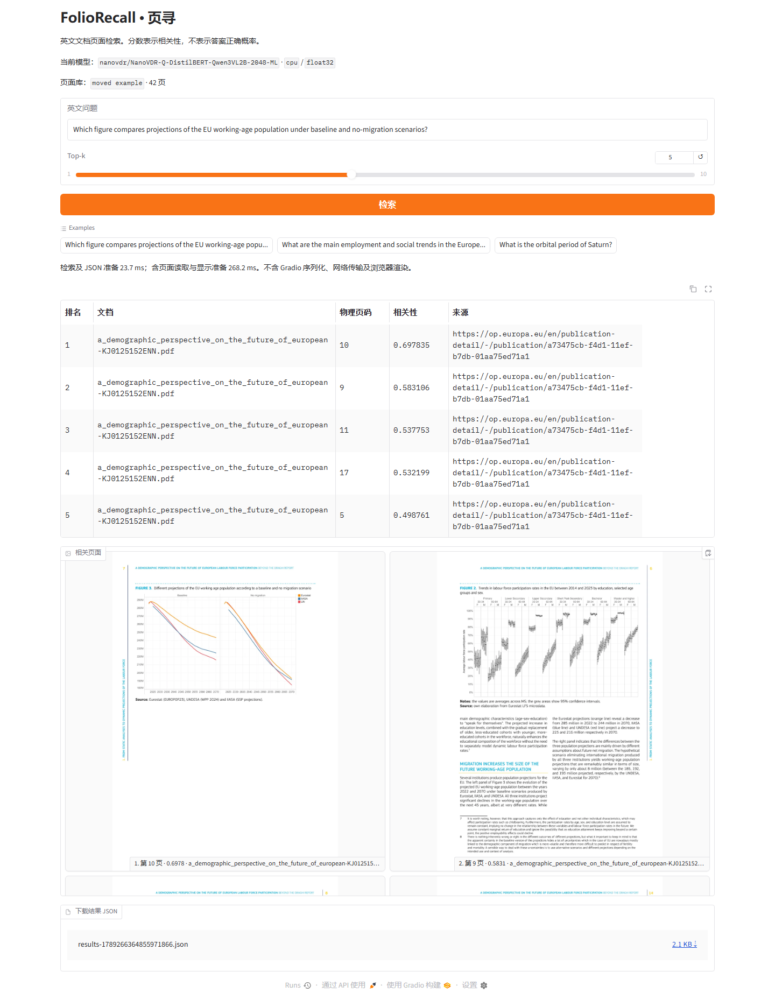

# FolioRecall（页寻）

Efficient Visual Document Retrieval

项目仓库：[linlin-is-me/FolioRecall](https://github.com/linlin-is-me/FolioRecall)。

FolioRecall 面向英文视觉文档检索，支持 PDF／页面图像导入、页面编码和索引、LoRA 检索微调、查询蒸馏及独立查询学生。离线由多模态教师编码页面，在线使用教师或与其对齐的学生搜索页面。本地常驻演示已在隔离CPU环境及GPU安装环境完成检索、页面展示与下载验证。

## 当前状态

第四阶段核心验收完成，本地 `0.1.0rc2` 待公开发布。五领域完整页面库共12969页、1489条英文查询，25组GPU与15组CPU学生/教师评测及五域BM25对照均已完成。两份真实PDF的安装态GPU建库、查询、页面演示及小样本断点恢复通过。第二、三阶段历史结果保留。

当前证据与下一步见[开发计划第1节](doc/多模态文档检索项目开发计划.md#当前开发重点)。默认部署仍为原始Qwen3-VL教师离线建库、公开ML学生GPU BF16在线查询；无GPU时提供CPU FP32体验。未传 `--query-config` 的CLI仍使用教师查询。

## 第四阶段：首版核心验收完成，待公开发布

安装验证范围为Python 3.10、Ubuntu／WSL。CPU隔离环境只缓存ML学生，无教师、CUDA、torchvision或训练组件；在非Git目录及移动后的示例中完成真实检索。GPU路径在RTX 4060 Laptop 8GB完成。源码、模型和Release尚未上传。



42页示例中，人口预测问题命中物理第10页Figure 3，下载JSON与CLI一致。素材属于European Union，来源、已知第三方图片剔除及许可条件见[使用说明](doc/首版使用与评测.md)。范围外查询仍可能返回无关页面；当前没有无答案检测、答案生成或中文评测。

| 查询候选 | 五领域宏平均 nDCG@10 | Recall@5 / @10 |
|---|---:|---:|
| 原始教师 GPU BF16 | 0.537845 | 0.479970 / 0.580596 |
| LoRA750 GPU BF16 | 0.573712 | 0.504133 / 0.612973 |
| 公开 EN GPU BF16 | 0.566762 | 0.497533 / 0.605997 |
| 公开 ML GPU BF16（默认） | 0.567706 | 0.502397 / 0.611766 |
| 蒸馏第94步 GPU BF16 | 0.437830 | 0.390437 / 0.484633 |
| 公开 EN CPU FP32 | 0.567026 | 0.497746 / 0.606333 |
| 公开 ML CPU FP32 | 0.567807 | 0.502201 / 0.611982 |
| 蒸馏第94步 CPU FP32 | 0.437294 | 0.389126 / 0.483769 |
| 页面 BM25 CPU | 0.516565 | 0.455363 / 0.553117 |

LoRA750相对原始教师的宏平均nDCG@10提高0.035867，五域中四域提高，Finance-EN下降0.021927；完整请求P50约44.72–45.07 ms，高于原始教师的30.66–32.37 ms。公开ML相对原始教师提高0.029861，同卡BF16编码P50快6.23–7.65倍，完整请求P50为4.51–6.61 ms。CPU ML是独立部署方案，不能把跨设备耗时比称为编码加速。第94步相对公开ML下降0.129877，保留为无收益对照，不更换默认模型，也不追加训练。

配对重采样使用(task, query_id)，固定seed42、10000次，任务内抽样后等权汇总。上述三组nDCG差值的95%区间分别为[0.024763, 0.046843]、[0.019750, 0.040209]、[-0.141093, -0.118967]。区间只描述这些固定任务的查询波动，不证明文档独立或上游未见过测试内容。公开学生的收益来自NanoVDR上游模型，本项目贡献是接入、匹配校验、继续蒸馏对照与完整评测。

正式评测使用原始相关性等级、完整候选库、batch1、线程4/1、5次预热和固定顺序3轮，各配置独立进程。完整请求从输入文本计时到Top-10 JSON就绪，加载及界面另计，不混合不同领域计算P95。逐领域质量、分项延迟、显存、RSS、建库成本、误例与局限见[首版使用与评测](doc/首版使用与评测.md#本轮实测结果)，机器记录为 `outputs/stage4/formal-complete`。

从本地源码目录安装 CPU 体验环境，或先解压源码包：

```bash
python3.10 -m venv .venv
source .venv/bin/activate
python -m pip install torch==2.8.0 --index-url https://download.pytorch.org/whl/cpu
python -m pip install '.[demo]'
python -c "from huggingface_hub import snapshot_download; snapshot_download('nanovdr/NanoVDR-Q-DistilBERT-Qwen3VL2B-2048-ML', revision='ab3f0fde9fcf407eaa756e1fc349ac09b7a716e7')"
# 解压本地 demo-bundle.zip 后，在 demo-bundle 目录执行：
CUDA_VISIBLE_DEVICES= HF_HUB_OFFLINE=1 foliorecall serve \
  --index . --config configs/baseline.json --query-config configs/student-ml-cpu.json
```

访问 `http://127.0.0.1:7860`。首次加载学生实测约 44 秒，之后模型保持驻留。42 页演示的暖态页面显示准备 P50/P95 为 272/285 ms，Gradio 客户端响应为 1.038/1.069 秒；后者仍不含预览下载与浏览器渲染，不能用核心约 20 ms 代替界面延迟。CPU 学生权重约 274 MB，示例 ZIP 约 14.63 MB；rc1历史安装产物位于 `outputs/stage4/packages/final`，示例为 `outputs/stage4/demo-bundle.zip`。尚无公开下载地址；42页素材及模型包内容已完成本地核对，公开发布仍待授权。

安装、示例获取位置、CPU快速体验、GPU自有PDF入口及评测命令见[首版使用与评测](doc/首版使用与评测.md)。当前本地候选为 `0.1.0rc2`，wheel和源码包位于 `outputs/stage4/packages/rc2-post-review`，旧rc1和rc2包保留；LoRA历史库与导出包的配套命令见使用说明，已补实际CLI验证。尚未发布到PyPI或Release。自有代码采用[Apache-2.0](LICENSE)，上游代码与素材说明见[NOTICE](NOTICE)。

## 第三阶段：查询学生与蒸馏比较已完成

2026-09-12：两款固定版本 NanoVDR 学生已完成CPU FP32与GPU BF16完整开发评测，原始教师完成同协议GPU测量。3000查询余弦蒸馏完成3个epoch，但最佳训练检查点低于公开ML初始化，按停止条件不扩到10000查询。保留公开学生与全部训练结果；第四阶段用户已选公开ML GPU BF16作为默认查询部署。独立 `--query-config` 复用匹配的原始教师页面索引；不传该参数仍使用教师查询。

| 查询候选 | nDCG@10 | Recall@5/10 | 编码 P50/P95 | 进程内完整请求 P50/P95 |
|---|---:|---:|---:|---:|
| 原始教师，GPU BF16 | 0.969236 | 0.995 / 0.995 | 30.03 / 51.95 ms | 30.56 / 52.56 ms |
| 公开英文，GPU BF16 | 0.971200 | 0.995 / 0.995 | 3.95 / 4.81 ms | 4.28 / 5.24 ms |
| 公开ML，GPU BF16 | 0.972699 | 0.995 / 0.995 | 3.96 / 7.81 ms | 4.33 / 8.19 ms |
| 蒸馏第94步，GPU BF16 | 0.953472 | 0.995 / 0.995 | 3.88 / 7.17 ms | 4.21 / 7.48 ms |
| 公开英文，CPU FP32 | 0.970853 | 0.995 / 0.995 | 18.63 / 23.67 ms | 19.03 / 24.08 ms |
| 公开ML，CPU FP32 | 0.972699 | 0.995 / 0.995 | 18.58 / 23.65 ms | 18.98 / 24.01 ms |
| 蒸馏第94步，CPU FP32 | 0.953253 | 0.995 / 0.995 | 18.67 / 23.84 ms | 19.07 / 24.27 ms |

全部使用冻结的200查询、原标签和完整1000页原始教师索引，Ryzen 7 8845H与RTX 4060 Laptop、PyTorch线程4、FAISS线程1、batch1，独立进程预热5次、重复3轮，重复排名一致。表中计时在模型与索引已加载后，从查询处理函数接收文本到Top-10结果JSON就绪。单次CLI命令每次都会加载模型，启动到退出的总耗时不等于上述请求时间；进程启动、模型与索引加载、终端输出、HTTP传输及界面渲染均不在计时内。这些是阶段三历史结果，演示及安装态测量另见第四阶段。

同卡BF16下，公开ML的编码P50约为教师的7.58倍速度，完整请求约为7.05倍；PyTorch峰值分配显存从4.274 GB降到0.151 GB，不含CUDA上下文等非PyTorch分配开销。CPU ML完整请求约19 ms，无在线GPU需求，进程峰值RSS约1.093 GB。学生权重约274.13 MB、教师约4.255 GB，共用索引约8.83 MB。GPU英文版本次P95较低，但两款学生结构相同，不能将单次进程间尾延迟差异归因于结构优势。

公开GPU英文与ML相对教师的nDCG分别增加0.001964和0.003463。这是接近上限的内部任务，公开学生上游包含VDR来源，具体重叠未核实，不作外部泛化结论。正式短跑第94/188/282步的nDCG为0.953472/0.950406/0.950406；最佳训练检查点相对ML初始化2条改善、14条退化、184条不变。开发查询与教师的平均余弦从0.729提高到0.896，仍未保留页面排序优势；没有发现教师身份错配、开发查询泄漏或512-token截断。五例复核保留具体符号、地点与编号退化及标签歧义证据，不修改标签。结果与逐请求时间见 `outputs/stage3/final-comparison-v2`，训练选模及复核见 `outputs/stage3/short-selection`。

已验证的CPU查询命令：

```bash
source scripts/activate_env.sh
CUDA_VISIBLE_DEVICES= HF_HUB_OFFLINE=1 python -m foliorecall query \
  --config configs/baseline.json --query-config configs/student-ml-cpu.json \
  --index indexes/vdr-dev-original 'How did El Niño in 1998 affect Okinawa reefs?' --json
```

目标缓存与 `distill` 已完成真实GPU运行：先生成64条并验证4步反传，随后补齐3000条目标，从公开ML重新训练。104个参数张量梯度有限且非零，六层注意力及两层投影实际更新，完整学生包保存重载最大差为0；学生独立加载不需要教师权重。阶段三未追加GPU恢复试验；第四阶段已在新目录完成4步连续与2+2步GPU恢复，参数、优化器、调度器、RNG和查询结果一致。

加载配置、资源明细、训练与恢复入口见[查询学生与蒸馏说明](doc/查询学生与蒸馏.md)。8小时模型任务预算累计使用514.41秒，含前轮CPU任务、加载、失败试跑、缓存、训练和诊断；不是只计反传时间。准备和文档时间另计，任务已经结束。

## 第二阶段接续

2026-09-12：3,000查询普通LoRA已完成750步及内部开发评测。20对训练负例完成助手视觉审计，固定256查询的原负例／回填负例对照已完成，第二阶段收尾。首个教师按已确认的保守策略选择原始模型；后续目标生成与蒸馏结果见第三阶段。

| 候选 | nDCG@10 | Recall@5 | Recall@10 |
|---|---:|---:|---:|
| 原始模型 | 0.969236 | 0.995 | 0.995 |
| 普通LoRA第339步 | 0.978095 | 0.990 | 0.995 |
| 普通LoRA第750步 | 0.977737 | 0.995 | 0.995 |

三组使用相同的200查询、完整1000页候选库和未修改标签，保存排名重算一致。最终相对原始10条改善、5条退化、185条不变。费用差异与诗歌案例的相关性争议足以翻转两个检查点的次序，未人工补标；保守选择原始教师不表示微调无效。这是单seed、接近上限的内部任务，不代表稳定或跨领域收益。

数据为固定revision的VDR英文部分：`data/vdr-stage2` 保存3000训练查询、200开发查询、5763训练页与1000开发页；先按全量页面池划分，再排除规范化重复查询组。保留无查询负页；原始文档身份未核实，只有页面级隔离。来源、划分、提取记录见该目录的 `source.json`、`split.json`、`extraction.json`；既有引用验证见 `outputs/stage2/data-check/final/result.json`。不重新下载英文分片。

普通训练使用 [configs/lora-baseline.json](configs/lora-baseline.json)：seed42、确定性模式、语言侧共享LoRA、CachedMNRL、逻辑batch4与微批1。此前小样本连续／恢复的224个适配器张量逐位一致；实际主训练从339步成功续跑到750步。最终适配器在独立建库和查询进程中加载成功，750步优化器恢复未再实测。

本轮审计对固定256查询及511页评分约489秒。随机10对中2对可能相关；低正负相似度差10对中4对可能相关、1对近重复、3对证据不足。混合抽样比例不能外推全体数据错误率。仅3条具备已核实的本地回填页，两组查询、正页及实际64个四查询批次一致；第33、47、56批发生负页变化。全部判断属于助手复核，不修改上游或开发标签。

对照复用 `train --checkpoint-only`，两组均完成64步及独立加载后的完整开发评测，第32／64步检查点均保存。第32步224个适配器张量逐位一致，最终224个张量均有差异，确认干预生效。64步适配器只用于方法诊断，不作为教师候选。记录的模型任务耗时约79.4分钟（具体统计边界见对照记录），低于4小时预算，计算进程已完成。数据及批次在 `data/vdr-stage2-control`，运行状态、命令与日志在 `outputs/stage2/negative-control`。已有输出不能直接覆盖。

| 256查询小对照 | nDCG@10 | Recall@5 | Recall@10 |
|---|---:|---:|---:|
| 原负例训练组，64步 | 0.977083 | 0.995 | 0.995 |
| 回填负例训练组，64步 | 0.977083 | 0.995 | 0.995 |

200条查询的原标指标逐条一致；110条Top-10列表虽有变化，相关页指标没有改善。完整对照及资源记录见 `outputs/stage2/negative-control/comparison-result.json`，运行和比较脚本随该实验目录保存。结论为本次3条回填未见收益，暂停扩大；不据此断言其他过滤策略无效。现有开发集接近上限，只有单seed与少量替换，回填同时改变了负例内容和难度。

本轮已运行入口：

```bash
source scripts/activate_env.sh
HF_HUB_OFFLINE=1 python -u scripts/audit_negatives.py
python scripts/prepare_negative_control.py
HF_HUB_OFFLINE=1 python -u -m foliorecall train \
  --config configs/lora-baseline.json --data data/vdr-stage2-control/original \
  --output outputs/stage2/negative-control/original --checkpoint-only --max-seconds 5635
```

评分与对照准备脚本固定实验目录并拒绝覆盖；以上是已完成运行的入口，不能直接在已有输出中重跑。回填组训练、两组独立index/evaluate的完整命令和预算覆盖参数见运行记录。`train --resume <checkpoint>` 继续支持在同配置、同数据与所属输出目录中恢复，旧组批格式不能按新规则续跑。

关键产物：

- 首个教师及完整编码配置：`outputs/stage2/teacher.json`，采用 `configs/baseline.json` 和匹配的 `indexes/vdr-dev-original`，该索引已复用加载验证。
- 普通LoRA：`outputs/stage2/lora/checkpoint-750/encoding.json`、同目录 `dev-index` 与 `dev-evaluation/result.json`；三模型逐查询分析在 `outputs/stage2/lora/quality-analysis.json`。
- 负例审计：`outputs/stage2/page-spot-check.json` 的 `training_negative_review`；评分、20对页面证据与3条替换在 `outputs/stage2/negative-audit`。
- 环境、确定性短跑及历史中断的配置、版本、耗时与局限统一通过[实验摘要](doc/experiments.csv)和相应运行目录接续，旧产物保留。本机不同运行段曾有明显耗时差异，原因未核实，不作速度收益结论。

## 本机开发环境

| 项目 | 实际位置或配置 |
|---|---|
| 开发系统 | WSL 2，Ubuntu-22.04，Ubuntu 22.04.5 LTS；当前默认用户 root |
| Windows 工作副本 | `D:\myproject\FolioRecall` |
| WSL 工作副本 | `/mnt/d/myproject/FolioRecall`，与 Windows 共用代码 |
| 独立 venv | `/root/.venvs/foliorecall_env`，不继承其他环境的 site-packages |
| Python | 系统 Python 3.10.12 创建的 venv |
| PyTorch / torchvision | `2.8.0+cu126` / `0.23.0+cu126`，CUDA runtime 12.6 |
| Sentence Transformers / Transformers | `6.0.1` / `5.16.1`；其他已验证直接依赖见 requirements.txt |
| 新增训练与数据组件 | PEFT `0.20.0`、datasets `5.0.1`、pyarrow `25.0.1`；安装后 pip check 与新增导入通过，fsspec 调整为 `2026.6.0` |
| 模型与数据集缓存 | `HF_HOME=/mnt/d/foliorecall_cache/huggingface` |
| 安装临时目录 | `TMPDIR=/mnt/d/foliorecall_cache/tmp` |
| GPU | NVIDIA GeForce RTX 4060 Laptop GPU，8188 MiB；驱动 610.74 |

环境创建前确认 Ubuntu 的 VHDX 位于 C 盘。宿主机 C 盘约余 11.1 GiB、D 盘约余 25.0 GiB；WSL 内部 `df` 显示的虚拟容量不能代替宿主机余量。环境使用 Linux 文件系统，较大的模型缓存和安装临时文件使用 D 盘。已有 Windows、Conda 与其他 venv 保持原状。

安装后环境约占 6.0 GiB，宿主机 C 盘约余 6.53 GiB、D 盘约余 24.98 GiB；安装临时文件已自动释放。后续模型与数据继续放在 D 盘缓存目录，下载前按实际需要确认余量。

后续会话在 PowerShell 执行：

```powershell
wsl -d Ubuntu-22.04
```

进入 WSL 后：

```bash
cd /mnt/d/myproject/FolioRecall
source scripts/activate_env.sh
```

激活脚本只加载现有环境并设置缓存路径，不安装依赖、不下载模型、不运行检查。它记录本机实际路径；其他机器按自己的用户与磁盘位置调整。

## 首次安装与必要检查

本机环境建立后直接复用。以下是重新准备环境时的步骤，执行前先确认目标环境是否已经存在，以及实际磁盘余量。

```bash
python3.10 -m venv /root/.venvs/foliorecall_env
mkdir -p /mnt/d/foliorecall_cache/huggingface /mnt/d/foliorecall_cache/tmp
cd /mnt/d/myproject/FolioRecall
source scripts/activate_env.sh
python -m pip install --no-cache-dir --upgrade pip
python -m pip install --no-cache-dir torch==2.8.0 torchvision==0.23.0 \
  --index-url https://download.pytorch.org/whl/cu126
python -m pip install --no-cache-dir -r requirements.txt
```

本机安装使用已有 `uv 0.12.7` 的 `uv pip install --python /root/.venvs/foliorecall_env/bin/python --no-cache ...` 并发获取依赖；它写入同一 venv，不创建第二套环境。D 盘临时目录与环境分属不同文件系统，安装采用复制；使用 uv 时可加 `--link-mode=copy`。上面的 pip 命令提供同版本安装入口。

PyTorch 与 torchvision 采用[官方配对版本及 CUDA 12.6 wheel](https://pytorch.org/get-started/previous-versions/#v280)。[Qwen3-VL-Embedding 模型卡](https://huggingface.co/Qwen/Qwen3-VL-Embedding-2B#usage)提供 PyTorch 2.8 和 Sentence Transformers 接入方式。当前依赖见 [requirements.txt](requirements.txt)，未安装 FlashAttention 或独立 CUDA Toolkit；新增训练组件的实际版本见上表。

首次接入、相关依赖变化或异常时才执行：

```bash
python -m pip check
python scripts/check_env.py
```

检查包括解释器隔离、必要依赖与 Qwen3-VL 类导入、合成空白页渲染、合成 FAISS 精确搜索、CPU 小矩阵运算，以及 GPU 可用时的一次 BF16 小矩阵运算。无需联网或模型权重；GPU 不可用时明确跳过 GPU 检查，仍可开展 CPU 工作。该检查不验证真实 PDF 导入、模型加载、LoRA 反传或检索质量。

### 本机验证记录

2026-09-09，在上述 WSL venv 中执行 `python -m pip check` 和 `python scripts/check_env.py`：

| 检查 | 结果 |
|---|---|
| 环境隔离 | `include-system-site-packages=false`，解释器位于上述 venv |
| 依赖一致性 | `No broken requirements found.` |
| 必要依赖与模型类导入 | requirements.txt 中的依赖、AutoProcessor 和 Qwen3VLModel 均成功导入；未加载模型权重 |
| PDF 渲染库 | 内存中新建 32×32 空白页面并渲染，尺寸检查通过 |
| FAISS | 3 个合成向量的内积精确搜索，返回 ID 与分数正确 |
| PyTorch CPU | 32×32 矩阵乘法结果检查通过 |
| RTX 4060 CUDA | CUDA 可用，32×32 BF16 矩阵乘法及同步后结果检查通过 |

环境稳定且依赖未改变时，直接激活并继续开发，无需重复以上检查。应用功能的实际验证状态见下节；查询学生的CPU命令见第三阶段说明。

## 第一阶段命令

在仓库根目录执行 `source scripts/activate_env.sh`。以下命令只使用同一个环境；新增的 `peft`、`datasets` 按 requirements.txt 安装，已有未变更组件不必重装。

已跑通的数据准备、真实 PDF 导入和 CPU 核心检查：

```bash
python scripts/prepare_data.py pdfs
python -m foliorecall import data/pdfs/*.pdf --output data/demo
python scripts/prepare_data.py hr
python scripts/prepare_data.py vdr
python scripts/prepare_data.py model
python -m unittest discover -s tests -v
```

两份报告的来源、revision、许可入口保存在 `data/pdfs/sources.json`；页面清单在 `data/demo/pages.jsonl`，预览在同目录的文档子目录。物理页码从 1 开始，与页面印刷页码可能不同。缓存链接保留原文件名；重复导入未变化的文件复用已有页面，输入变化按路径、大小、修改时间和 DPI 更新对应结果。每次 import 输出本次输入的完整清单，不自动追加其他文档。损坏或加密 PDF 的跳过原因写入 `import-errors.json`。

实际验收：两份报告分别 20、25 页，物理页码连续；混合导入一个加密测试文件时，记录密码错误并保留其余 45 页。3 项 CPU 测试覆盖索引重载与来源映射、配置错配、分级多正例指标及损坏输入。记录保存在本地 `outputs/cpu-validation`、`outputs/data-validation`、`outputs/vdr-validation`。[人工查询案例](examples/demo_queries.json)对应人口报告物理第 10 页的 Figure 3，官方 HR 页面 ID 为 1028，印刷页码为 7；两条导入路径已视觉核对。

已跑通原始模型建库与查询：

```bash
python -m foliorecall index --pages data/demo/pages.jsonl --output indexes/demo-original
python -m foliorecall query --index indexes/demo-original 'Which figure compares projections of the EU working-age population under baseline and no-migration scenarios?'
```

45 页建库约 41.4 秒，PyTorch 峰值显存约 4.24 GiB；时间包含页面读取、编码和索引保存，不含模型加载。结构化查询结果见本地 `outputs/demo-query.json`，来源核对见 `outputs/demo-query-check.json`。当前 Sentence Transformers 的图像参数分组为 `image`；修复后两页探测不再出现未知参数警告，实际网格与输入形状保存在 `indexes/probe-original-validated/encoding-probe.json`。模型首次下载曾停顿，使用 aria2 HTTP 续传恢复，现已接回标准 Hugging Face 缓存；aria2 仅用于下载故障恢复，不是应用运行依赖。

完整 HR 评分与训练入口：

```bash
python -m foliorecall index --pages data/hr/pages.jsonl --output indexes/hr-original
python -m foliorecall evaluate --index indexes/hr-original --output outputs/hr-original
python -m foliorecall train-smoke --output outputs/train-smoke
```

默认配置为 `configs/baseline.json`，可用 `--config` 指定配置，查询加 `--json` 输出结构化结果。图像入口使用 `import --image-manifest <JSONL> --output <目录>`；每行提供 `page_id`、`doc_id`、`source`、从 1 开始的 `page_number`、`preview`，预览相对清单目录解析。HR 基准直接使用官方图像，不使用演示 PDF 的重新渲染图像。

本机 4 步训练已通过：语言侧注意力 LoRA 共 3,211,264 个参数，224 个张量实际更新；每步损失与梯度有限，冻结参数无梯度。损失依次为 0.167308、0.036332、0.015513、0.028853，各步使用不同样本，不据此判断收敛。训练耗时 221.1 秒，PyTorch 峰值显存约 7.04 GiB，未启用梯度检查点。适配器保存重载后两页向量最大绝对差为 0，随后完成 8 个开发页面建库与 4 条开发查询检索。完整记录在 `outputs/train-smoke/result.json`，适配器在 `outputs/train-smoke/adapter`，仅约 6.45 MB；仍需原始模型权重。

微调模型查询使用配套配置和索引：

```bash
python -m foliorecall query --config outputs/train-smoke/config.json \
  --index outputs/train-smoke/index 'your English query' --json
```

该入口已在独立进程用开发查询验证，正常返回 5 条带页码与预览信息的 JSON 结果，记录在 `outputs/train-smoke/cli-query.json`。原始模型配置与微调索引不可混用。后续训练显存不足时，用新的输出目录加 `--gradient-checkpointing` 重试；失败记录保留在 `failure.json`。

VDR 按列读取了完整英文元数据：94,225 页、53,512 条非空查询，保留无查询页面记录。切片服务不覆盖整库，本次仅从前 1000 行中选择满足隔离要求的 8 条训练查询、4 条开发查询及原始负页面，共 24 张图像。全部图像可解码，正负页面跨划分无交叉，负例均在原始标注列表内。选择规则、原始负例和排除项保存在 `data/vdr`；这组前部小样本仅检查流程，页面级隔离不等于已经确认原始文档隔离。正式训练应按源 Parquet 获取页面，不能沿用切片服务限制来代表全量数据。

HR 使用完整 1110 页候选库与种子 42 抽出的 20 条英文查询，保留多页标签和相关性等级。实际建库 1031.0 秒，PyTorch 峰值显存 4.24 GiB；nDCG@10 为 0.5951，Recall@5/10 为 0.5890/0.6829。模型驻留并预热一次后，查询编码与 FAISS 搜索的 P50/P95 为 52.0/67.4 ms，不含进程启动和模型加载；评测峰值显存约 3.98 GiB。结果见 `outputs/hr-original/result.json`，索引在 `indexes/hr-original`。这些结果只作早期流程检查，未用于调参，不代表完整 ViDoRe 成绩。nDCG 使用线性等级增益，Recall 对等级大于 0 的相关页面计算。

收尾验证命令为 `python -m unittest discover -s tests -p test_closeout.py -v`，2 项针对性 CPU 测试通过，包括遗漏非相关候选时在模型加载前报错。既有 1110 页的行号从缓存 Parquet 的元数据列回填，原字段与索引向量保持不变，记录在 `outputs/stage1-closeout`，索引目录的 `metadata-update.json` 指向该记录。此次未读取图像、重新编码或重跑训练，既有质量与资源数字仍来自 2026-09-09 的运行。

索引保存生效配置与页面映射；关键运行在产物目录保存 `run.json`、命令参数、必要的未提交差异和结果，训练同时保存样本清单。[实验摘要](doc/experiments.csv)关联实际代码版本、配置和本地产物；HR 评测与训练运行于干净的 `7b1bf91`，演示建库的未提交代码差异已随运行保存。已存在的索引拒绝覆盖，重建时使用新目录。修改输入、预处理或适配器时使用新产物目录并重建匹配索引。下载数据、模型、生成预览及索引均不提交 Git。

## 使用范围与上游来源说明

首版接入英文页面检索，中文、答案生成、重排序及候选方法按开发计划择需启用。公开学生与本项目继续蒸馏学生均完成CPU/GPU检索；中文学生、ONNX/int8和多深度学生尚未实现。界面仅面向本地单用户和一个常驻模型，不提供公网、多用户或在线建库管理。

编码与训练接入 [Qwen3-VL-Embedding](https://huggingface.co/Qwen/Qwen3-VL-Embedding-2B) 和 [Sentence Transformers](https://github.com/huggingface/sentence-transformers) 的现成接口，精确搜索使用 [FAISS](https://github.com/facebookresearch/faiss)。本项目的开发工作包括可恢复文档导入、数据筛选与划分、教师身份校验、完整学生包接入、余弦蒸馏目标、分项计时、官方指标对照、CPU安装与常驻页面演示。模型骨干、训练器、FAISS、BM25和Gradio复用上游实现。普通LoRA在固定五领域任务中宏平均nDCG提高0.035867，Finance-EN退化，未验证多seed稳定性和文档独立泛化；本地3000查询蒸馏在内部开发及五领域正式比较均未改善检索。上游来源与兼容边界见第三阶段说明。

自有代码采用 [Apache-2.0](LICENSE)，上游说明见 [NOTICE](NOTICE)。模型、数据和示例素材分别遵守上游许可，不因代码许可而变更。

## 开发文档

- [协作约定](AGENTS.md)
- [项目开发计划](doc/多模态文档检索项目开发计划.md)
- [分阶段开发提示词](doc/FolioRecall_分阶段开发提示词.md)

当前沿用已有 `doc/` 目录。实验与代码按实际开发逐步增加，不预建空模块或复杂 CI。大模型、原始数据、缓存与生成索引不纳入 Git 提交。
