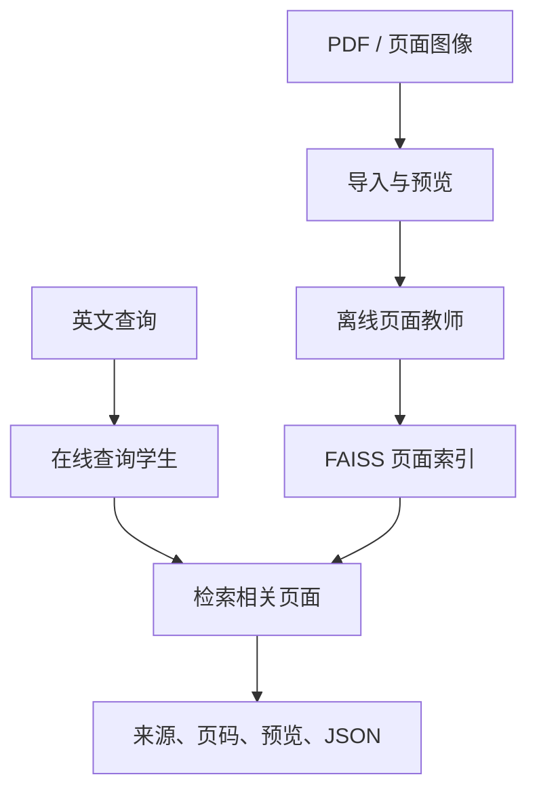

<h1 align="center">FolioRecall · 页寻</h1>
<p align="center"><strong>Page-level visual document retrieval with lightweight query encoders</strong></p>
<p align="center">检索英文文档中的相关页面，返回文档来源、物理页码和页面预览。</p>

<p align="center">
  <a href="LICENSE"></a>
  <a href="#快速开始"></a>
  <a href="pyproject.toml"></a>
</p>
<p align="center"><a href="README.md">English</a> · <strong>简体中文</strong></p>
<p align="center"><a href="#演示">演示</a> · <a href="#结果">结果</a> · <a href="#快速开始">快速开始</a> · <a href="#模型与文档">文档</a></p>

FolioRecall 分离离线页面编码和在线查询编码：多模态教师建立页面索引，与教师对齐的轻量学生执行查询。项目提供可用的检索应用，同时支持 LoRA 训练、查询蒸馏，以及质量与成本评测。

> 源码已公开，示例包和实验附件待发布。

## 功能

- **页面检索：** 导入 PDF 或页面图像，返回排序后的页面、来源、物理页码、预览及可下载的 JSON。
- **独立查询编码：** 加载完整 Qwen3-VL 或 NanoVDR 模型包，在模型加载前检查教师与索引的兼容性。
- **可恢复建库与本地服务：** 分块保存页面向量，CLI 和单模型常驻 Gradio 应用共用检索逻辑。
- **训练与评测：** 支持 LoRA 微调、查询向量蒸馏、BM25 与神经检索对照，记录延迟和资源开销。

## 演示

英文人口预测问题命中欧盟报告的**物理第 10 页、Figure 3**。下图来自 42 页示例索引的真实 CPU 检索，当前界面为中文。

<p align="center">
  <a href="doc/assets/stage4-cpu-demo.png"></a>
</p>

截图展示已有本地示例，其下载包尚待发布。当前可按下方 GPU 流程为自有 PDF 建库。

## 架构



默认采用**原始 Qwen3-VL-Embedding-2B 建库，公开 NanoVDR ML 执行 GPU BF16 查询**。CPU FP32 查询可复用同一原始教师索引。LoRA 需要自身的匹配页面索引，向量维度相同不足以证明兼容。CLI 不传 `--query-config` 时仍使用教师查询。

本项目实现模型接入、索引兼容检查、可恢复数据处理、CLI 与界面检索及受控实验。骨干和公开查询学生来自上游项目。

## 结果

HR、Computer Science、Finance-EN、Industrial 和 Pharmaceuticals 五个固定英文任务共包含 **12,969 页、1,489 条查询**。各任务保留完整候选库和原始分级标签。下表按领域等权平均；神经模型使用 GPU BF16，BM25 在 CPU 上使用官方页面 markdown。

| 查询模型 / 方法 | nDCG@10 | Recall@5 | Recall@10 |
|---|---:|---:|---:|
| 原始 Qwen3-VL 教师 | 0.537845 | 0.479970 | 0.580596 |
| LoRA750 | **0.573712** | **0.504133** | **0.612973** |
| 公开 NanoVDR EN | 0.566762 | 0.497533 | 0.605997 |
| 公开 NanoVDR ML · 默认 | 0.567706 | 0.502397 | 0.611766 |
| 继续蒸馏 · 第 94 步 | 0.437830 | 0.390437 | 0.484633 |
| 页面级 BM25 | 0.516565 | 0.455363 | 0.553117 |

- **本地 LoRA 微调：** 相对原始教师，nDCG@10 提高 **0.035867**，四个领域提高，**Finance-EN 下降 0.021927**；查询延迟增加。
- **公开 ML 查询学生：** 同卡 BF16 下，编码 P50 比原始教师快 **6.23–7.65 倍**，该收益来自 NanoVDR 上游模型。本项目继续蒸馏后的 nDCG@10 相对公开 ML **下降 0.129877**，第 94 步保留为无收益对照。

| GPU 查询模型 | 各领域完整本地请求 P50 |
|---|---:|
| 原始教师 | 30.66–32.37 ms |
| LoRA750 | 44.72–45.07 ms |
| 公开 ML | 4.51–6.61 ms |

测量使用 **RTX 4060 Laptop 8GB**、batch1、PyTorch/FAISS 线程 4/1、5 次预热，各配置在独立进程中按固定查询顺序运行 3 轮。完整请求从输入文本计时至 Top-10 JSON 就绪，不包含模型加载、界面准备和浏览器渲染。表中范围来自各领域的 P50，未混合不同领域计算延迟统计。CPU 作为独立部署方案报告，不计作同设备编码加速。

[完整结果与评测协议](doc/首版使用与评测.md#本轮实测结果)包含 CPU 对照、配对置信区间、逐领域计时、内存、建库成本及误例分析。

## 快速开始

已验证 **Python 3.10、Ubuntu 22.04 / WSL 2**。GPU 建库和查询在 RTX 4060 Laptop 8GB 上完成验证，其他平台尚未实测。以下步骤在同一个 Bash 终端执行。

### 源码安装

安装已有索引查询、界面和评测所需的 CPU 依赖。帮助命令只检查 CLI 入口，不建立索引或运行模型。

```bash
git clone https://github.com/linlin-is-me/FolioRecall.git
cd FolioRecall
REPO=$(pwd -P)
WORK="$REPO/outputs/quickstart"
mkdir -p "$WORK"
python3.10 -m venv "$WORK/venv-cpu"
CPU_PY="$WORK/venv-cpu/bin/python"
"$CPU_PY" -m pip install torch==2.8.0 --index-url https://download.pytorch.org/whl/cpu
"$CPU_PY" -m pip install '.[demo,eval]'
"$CPU_PY" -m pip check
CUDA_VISIBLE_DEVICES= "$CPU_PY" -m foliorecall --help
```

### GPU 自有 PDF

此流程需要支持 CUDA 的 GPU、教师权重和新建的页面索引。首次加载按配置中的固定 revision 下载完整上游模型，不依赖本项目待发布的 Release 附件。

<details>
<summary>安装 GPU 环境，导入 PDF、建库并查询</summary>

沿用上一步的 `REPO` 和 `WORK`。将 `PDF` 改为实际文件，首次执行时使用新的输出目录。

```bash
cd "$REPO"
python3.10 -m venv "$WORK/venv-gpu"
GPU_PY="$WORK/venv-gpu/bin/python"
"$GPU_PY" -m pip install torch==2.8.0 torchvision==0.23.0 --index-url https://download.pytorch.org/whl/cu126
"$GPU_PY" -m pip install '.[demo,image]'
"$GPU_PY" -m pip check
PDF="$HOME/Documents/report.pdf"
"$GPU_PY" -m foliorecall import "$PDF" --output "$WORK/my-pages"
"$GPU_PY" -m foliorecall index --config "$REPO/configs/baseline.json" \
  --pages "$WORK/my-pages/pages.jsonl" --output "$WORK/my-index" --chunk-size 64
"$GPU_PY" -m foliorecall query --config "$REPO/configs/baseline.json" \
  --query-config "$REPO/configs/student-ml-cuda.json" --index "$WORK/my-index" \
  'What are the main findings of this report?' --json
"$GPU_PY" -m foliorecall serve --config "$REPO/configs/baseline.json" \
  --query-config "$REPO/configs/student-ml-cuda.json" --index "$WORK/my-index"
```

打开 `http://127.0.0.1:7860`。应用仅监听本机，持续加载一个查询模型和一个索引。切换 CPU 流程前按 Ctrl+C 停止服务。完整索引不允许覆盖；只有输入和配置不变的中断任务才使用 `index --resume` 接续。

</details>

### CPU 查询与示例

CPU 查询需要**已有的原始教师索引**。此路径只加载查询学生，不需要教师权重、CUDA、torchvision 或训练组件。使用上面建立的索引执行：

```bash
CUDA_VISIBLE_DEVICES= "$CPU_PY" -m foliorecall query --config "$REPO/configs/baseline.json" \
  --query-config "$REPO/configs/student-ml-cpu.json" --index "$WORK/my-index" \
  'What are the main findings of this report?' --json
CUDA_VISIBLE_DEVICES= "$CPU_PY" -m foliorecall serve --config "$REPO/configs/baseline.json" \
  --query-config "$REPO/configs/student-ml-cpu.json" --index "$WORK/my-index"
```

使用其他已有索引时，替换 `--index` 路径并提供其匹配的教师配置。**42 页示例包尚未开放下载**，依赖该附件的[使用步骤](doc/首版使用与评测.md#42页-cpu-示例待release发布)单独保留。CPU 查询支持不代表 CPU 教师建库已经验证。

## 模型与文档

| 资产 | 获取状态 | 入口 |
|---|---|---|
| 原始 Qwen 教师 | 上游可获取 | [固定教师配置](configs/baseline.json) |
| 公开 NanoVDR EN / ML | 上游可获取 | [EN GPU](configs/student-en-cuda.json) · [ML GPU](configs/student-ml-cuda.json) · [ML CPU](configs/student-ml-cpu.json) |
| 42 页示例包 | 待项目 Release 发布 | 预建索引、预览、来源及素材许可 |
| LoRA750 适配器 | 待项目 Release 发布 | 适配器包；建立并查询自身匹配索引 |
| 第 94 步蒸馏学生 | 待项目 Release 发布 | 完整学生包；匹配原始教师索引；实验对照 |
| 实验附件与资产清单 | 待项目 Release 发布 | 详细结果、运行记录及资产来源 |

公开教师和学生按配置中的模型 ID、固定 revision 从上游获取，不随 FolioRecall 重复分发。以下详细文档目前均为中文。

- [安装、数据准备、BM25 与五域复现](doc/首版使用与评测.md#外部获取与复现)
- [训练与蒸馏复现](doc/首版使用与评测.md#训练与蒸馏复现) · [查询学生实验](doc/查询学生与蒸馏.md)
- [实验记录](doc/experiments.csv) · [开发计划与当前状态](doc/多模态文档检索项目开发计划.md#当前开发重点)

## 局限

- 检索评测覆盖英文文档与查询。答案生成、无答案识别、中文检索、重排序和 ONNX/int8 部署尚未实现或验证；范围外查询仍可能返回无关页面。
- 结果来自单个训练 seed 和固定评测任务。HR 中 20 条查询曾用于流程检查，上游训练重叠与文档级独立性尚未核实。
- 公开学生的上游教师指令与本项目不同，其实际教师 revision 和图像参数未完整公开。
- LoRA 收益随领域变化，继续蒸馏未保留公开 ML 的质量。历史 HR 建库缺失部分资源测量，详细表格仍保留缺失状态。
- 应用面向本地单用户。GPU 教师建库与 CPU 学生查询的资源需求不同。

## 参与与许可

欢迎在 [Issues](https://github.com/linlin-is-me/FolioRecall/issues) 提交可复现问题或具体改进建议，并附命令、环境、配置及错误输出。开发前参阅[协作约定](AGENTS.md)和[完整开发历史](https://github.com/linlin-is-me/FolioRecall/commits/main/)。

自有代码采用 [Apache-2.0](LICENSE)，Qwen、NanoVDR、Sentence Transformers 等上游来源见 [NOTICE](NOTICE)。模型与数据分别遵循其许可。示例保留 European Union 来源和素材许可，剔除已知第三方图片，不附完整 PDF；代码许可不覆盖上游文档。
